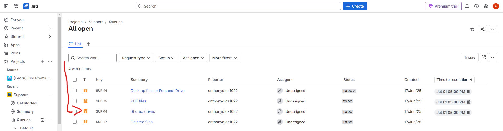
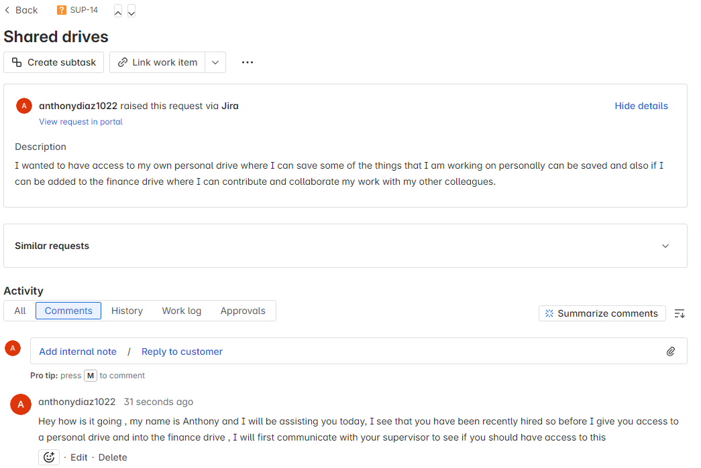
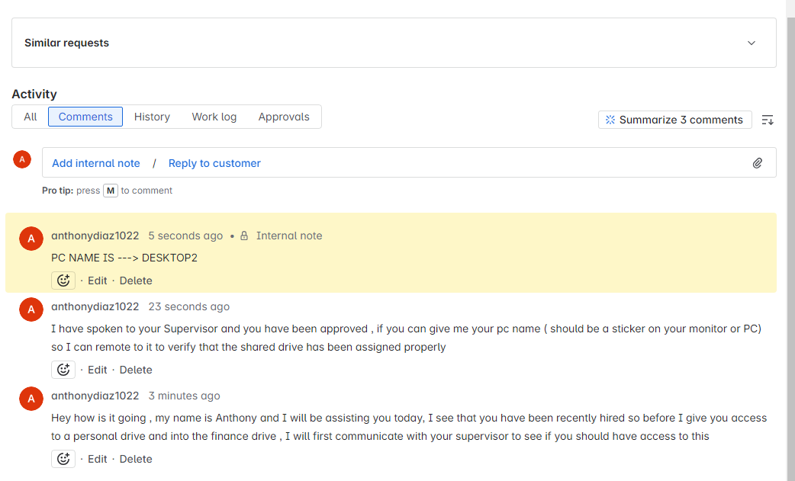
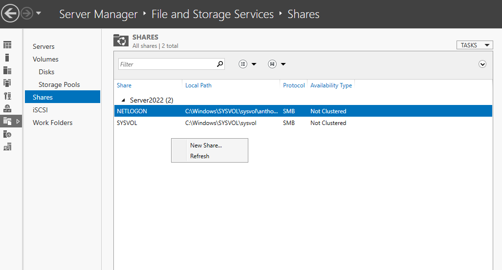
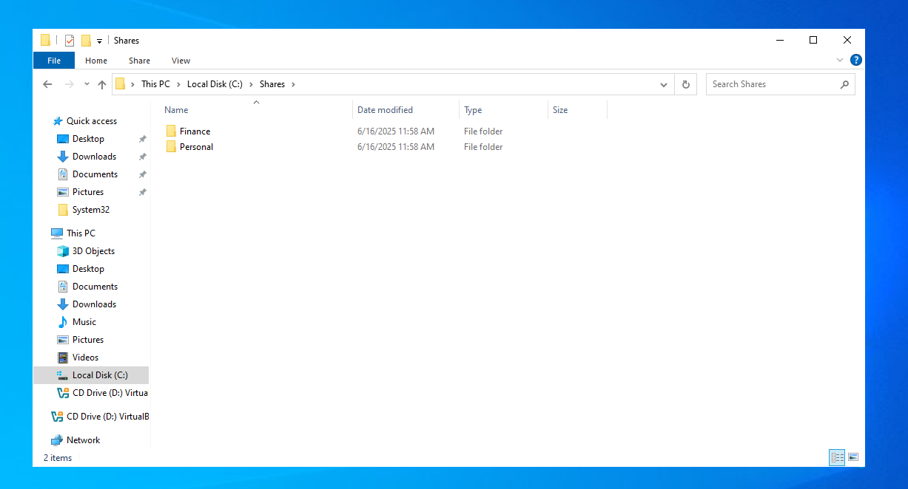
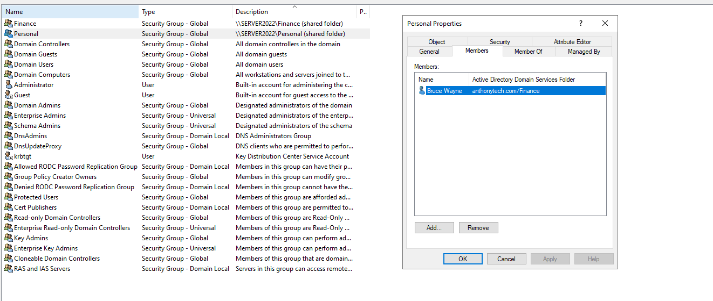
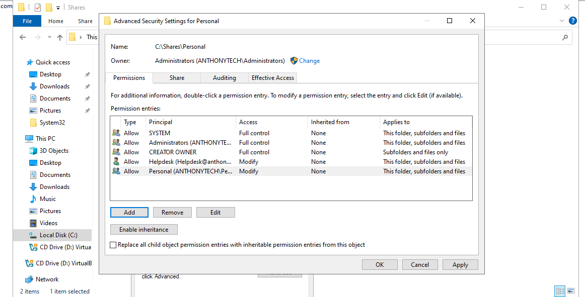
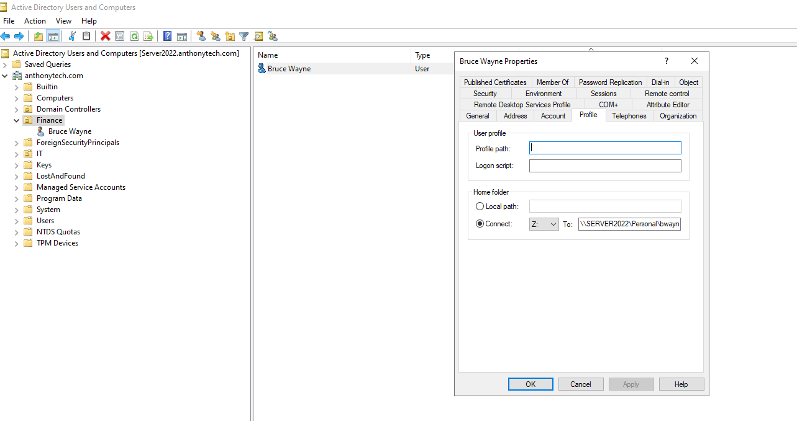
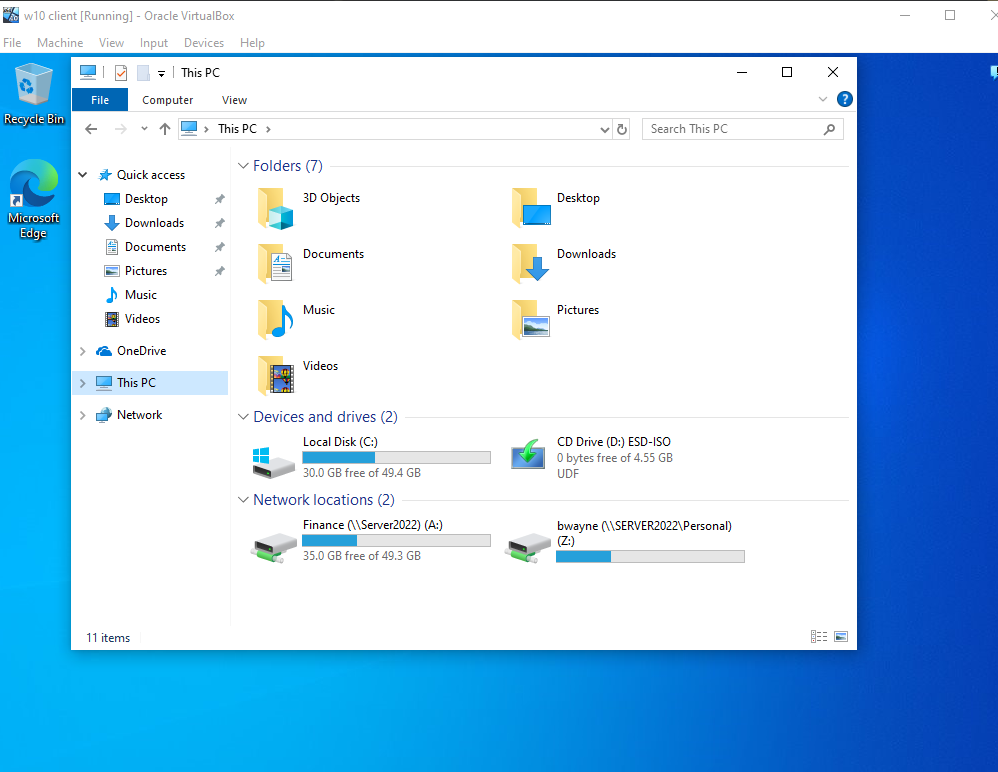
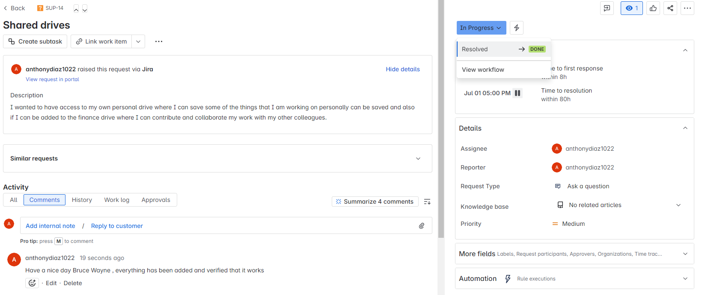

# 🛠️ Ticket Resolution: Shared Drives Access

This document outlines the resolution of Jira ticket SUP-14, where the user requested access to two shared network drives: a Personal Drive and the Finance Department Drive. The request was resolved through Active Directory configuration, security group assignment, shared folder creation, and access verification.

🎫 Ticket Overview

- Ticket ID: SUP-14

- Request Summary: Shared drives

- Issue: User requested access to:

    - A personal drive for storing individual work

    - The finance department drive to collaborate with colleagues
 
In the image down below we can see that there are a number of tickets that are open , however we see that SUP-14 has been the oldest one so we go ahead and solve that issue first
 

## Initial Response 

As the IT Help Desk Support employee I greeted the user and acknowledge the request, since the user was newly onboarded, in the iamage down below you can see that the IT employee noted that they would need supervisor approval would be required before they can have access to the both drives 

## ✅ Supervisor Approval & PC Name

- The IT Technician ( in this case its me) has communicated with the users supervisor , this is an important step as we now know they have permission to access these files and folders
- Also the PC Name was given to then have access to remote into that users computer , and was added as an internal note
- Internal note added: PC NAME IS ---> DESKTOP2
- Internal note is used for future references if I need to look back at the ticket this note wil be their ( only other IT Techs can see this )

## 📁 Creating the Shared Drives

Using Server Manager on the DC ---> Server2022: 

1. Navigated to File and Storage Services > Shares

2. Created two new shares:

   - \\Server2022\Personal
   - \\Server2022\Finance
  

## Configuring Security Groups

In Active Directory Users and Computers (ADUC):

- Created two security groups:

  - Personal

  - Finance

Added Bruce Wayne as a member of both groups

## 🔐 Setting NTFS Permissions

- On the Personal share folder (C:\Shares\Personal), permissions were set to allow:

    - Modify access for Helpdesk, so the helpdesk technician , in this case me can have access to it from the helpdesk desktop instead of having to use the DC 

    - Modify access for Personal security group , which is the group where we added the user bwayne into

## Mapping the Drive

In Bruce Wayne’s profile settings (ADUC):

- Mapped a Z: drive to \\Server2022\Personal\bwayne

Now the next time he logs in he will have access to his persona drive 

## Verification

Remotely connected to DESKTOP2:

- Verified that both:
      - Finance Shared drive
      - Personal Shared drive have been assigned

 

 
## ✅ Ticket Closure

- Final message sent to user: "Have a nice day Bruce Wayne, everything has been added and verified that it works"

- Ticket status updated to Done

 

##📌 Summary

This ticket demonstrates:

  - Best practices in user onboarding
    
  - Role-based access control using security groups
  
  - Proper use of Active Directory and Server Manager for secure folder sharing
  
  - How to resolve a common real-world IT support request through structured workflow and communication

  
##✅ Ticket SUP-14 resolved successfully and documented for reference.

